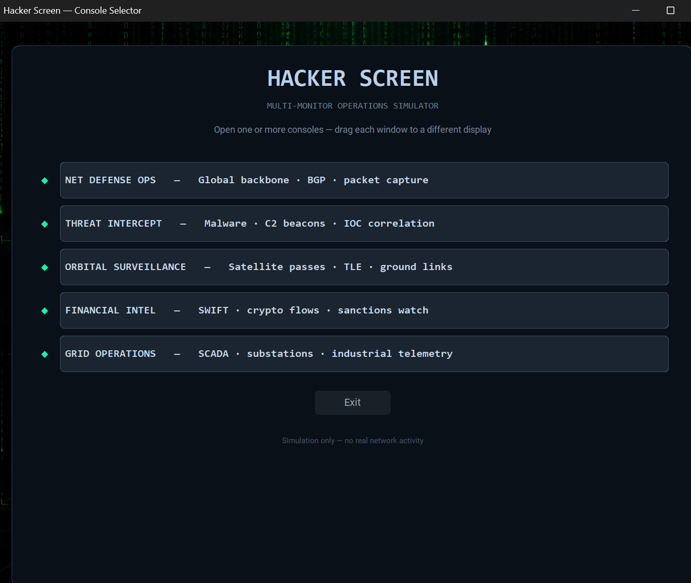
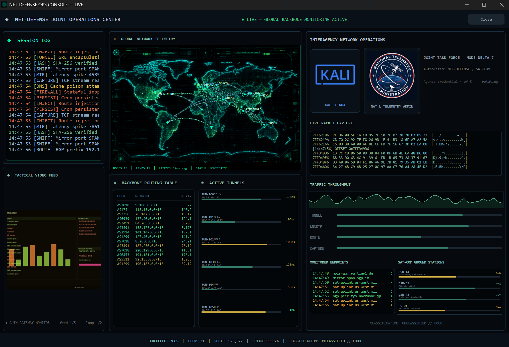
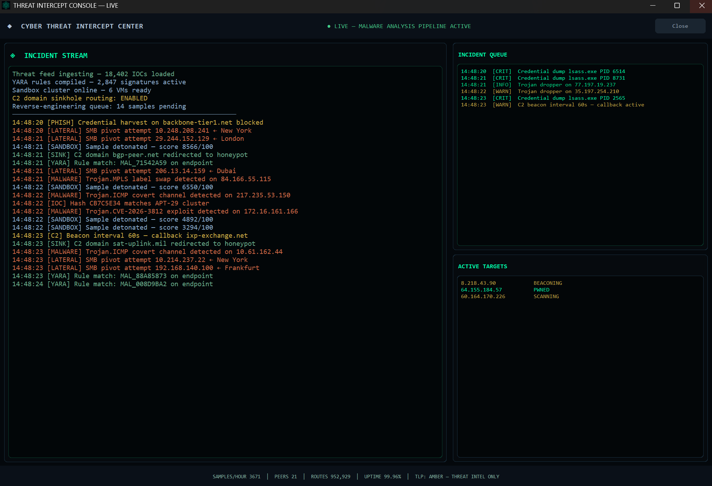
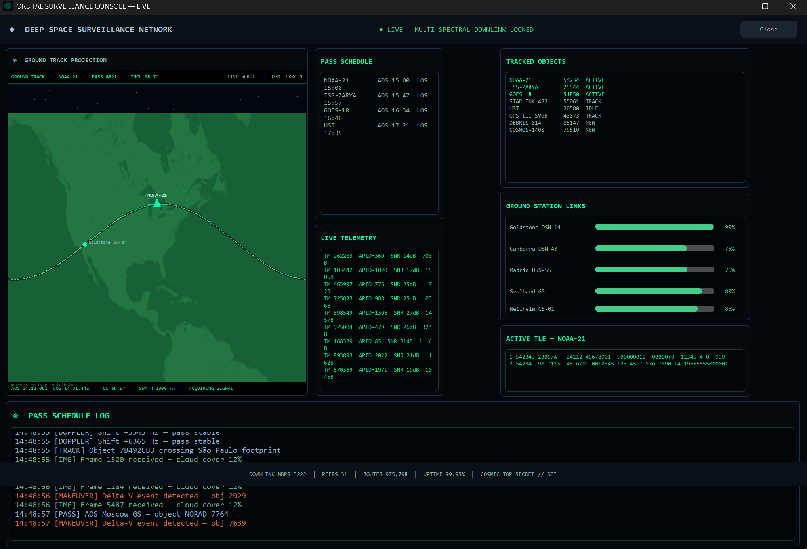
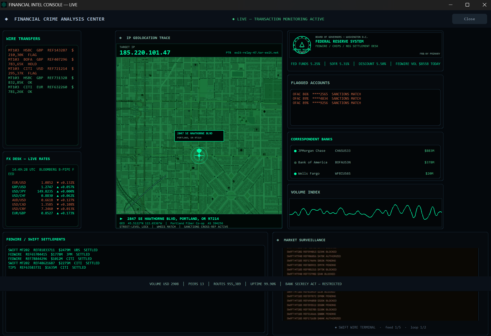
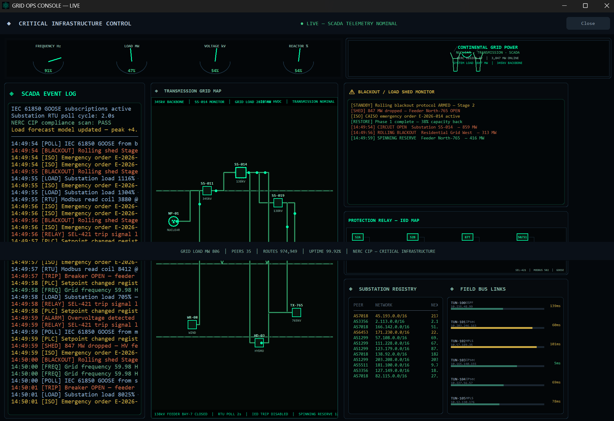

# Hacker Screen

A multi-console **operations dashboard simulation** for Windows and Python. Pick a console from the launcher and get a full-screen, cinematic ops desk — session logs, animated maps, telemetry panels, and tactical video feeds.

**Visual simulation only.** No network scanning, exploitation, or real hacking.



## Consoles

| Console | Focus |
|---------|--------|
| **Net Defense Ops** | Global backbone, BGP routing, packet capture |
| **Threat Intercept** | Malware pipeline, incident queue, target list |
| **Orbital Surveillance** | Satellite passes, ground track, TLE telemetry |
| **Financial Intel** | SWIFT/FedWire monitoring, FX desk, IP geolocation |
| **Grid Operations** | SCADA telemetry, transmission grid, blackout alerts |

### Net Defense Ops



### Threat Intercept



### Orbital Surveillance



### Financial Intel



### Grid Operations



## Download (Windows)

**[Latest release](https://github.com/AlanCalhoun/hacker-screen/releases)** — download `NetDefenseOpsConsole-Setup-*.exe` and run. Per-user install, no admin required.

See [docs/INSTALL.md](docs/INSTALL.md) for portable, pip, and developer options.

## Quick start (from source)

Requires **Python 3.10+**.

```powershell
git clone https://github.com/AlanCalhoun/hacker-screen.git
cd hacker-screen/app
python -m pip install -r requirements.txt
python main.py
```

Or double-click `app\run.bat` on Windows.

## Repository layout

```text
hacker-screen/
  app/              Source code, assets, dev entry point
  distributions/    Build output (installer, portable, wheels)
  release/          Packaging scripts and pip metadata
  docs/             Install and release guides
  Screenshots/      Gallery images
```

## Build Windows installer

Requires Python, PyInstaller, and [Inno Setup](https://jrsoftware.org/isinfo.php) on the build machine.

```powershell
powershell -ExecutionPolicy Bypass -File release\packaging\build_windows.ps1
```

Installer: `distributions/installer/NetDefenseOpsConsole-Setup-1.1.0.exe`  
Portable: `distributions/portable/NetDefenseOpsConsole/`

Publish to GitHub Releases — see [docs/RELEASING.md](docs/RELEASING.md).

## Tech stack

- Python 3.10+, [CustomTkinter](https://github.com/TomSchimansky/CustomTkinter)
- Pillow, NumPy, OpenCV (video feeds)
- PyInstaller + Inno Setup (Windows distribution)
- OpenStreetMap tiles (themed) for select map panels — © OpenStreetMap contributors

## License

[MIT](LICENSE) — see [LICENSE](LICENSE).

## Contributing

See [CONTRIBUTING.md](CONTRIBUTING.md). Security notes: [SECURITY.md](SECURITY.md).

## Disclaimer

This software is for entertainment, film, and desk-decoration use. Simulated data is fictional. Do not use it to imply unauthorized access to real systems.
